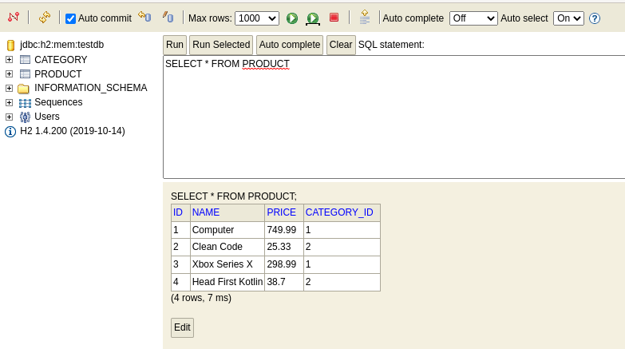

# First-spring-project
## Requirements
- Java11+ (I used java 11 LTS)
- Spring tool suite or Eclipse
## Diagrams
### Conceptual model

 
 
 
 
### Instance

 
 
 
 
## H2
### H2 Connect

 
 
 
 
### H2 Category

 
 
 
 
### H2 Product

